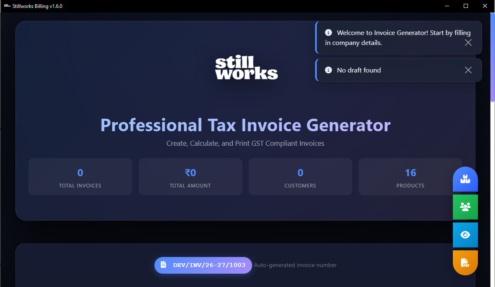

<p align="center">
  
</p>

<h1 align="center">StillWorks Billing Suite</h1>

<p align="center">
  <b>A modern, fast, and professional billing & invoice management system</b><br>
  Built for real-world business workflows 🚀
</p>

<p align="center">
  
</p>

---

## 📌 Overview

**StillWorks Billing Suite** is a lightweight yet powerful billing application designed to create, manage, and generate professional invoices with ease.  
It is ideal for **studios, agencies, service providers, and small businesses** that require accuracy, speed, and clean invoice layouts.

---

## ✨ Features

✅ Customer Management  
✅ Itemized Goods & Labour Charges  
✅ Automatic Area & Rate Calculations  
✅ Advance Payment Handling  
✅ GST / Tax-ready Structure  
✅ Clean & Printable Invoice Design (A4)  
✅ MongoDB Integration  
✅ Flask-powered Backend  
✅ Desktop-Friendly & Web-Based  

---

## 🛠️ Tech Stack

- **Backend:** Python (Flask)
- **Database:** MongoDB
- **Frontend:** HTML, CSS, JavaScript
- **PDF/Print:** A4 Invoice Layout
- **Environment:** Virtualenv

---

## 📂 Project Structure

```bash
stillworks-billing-suite/
│
├── app.py
├── desktop.py
├── config.py
├── requirements.txt
├── .env
│
├── templates/
│   ├── invoice.html
│   └── base.html
│
├── static/
│   ├── css/
│   ├── js/
│   └── images/
│       ├── logo.png
│       └── banner.png
│
└── README.md
